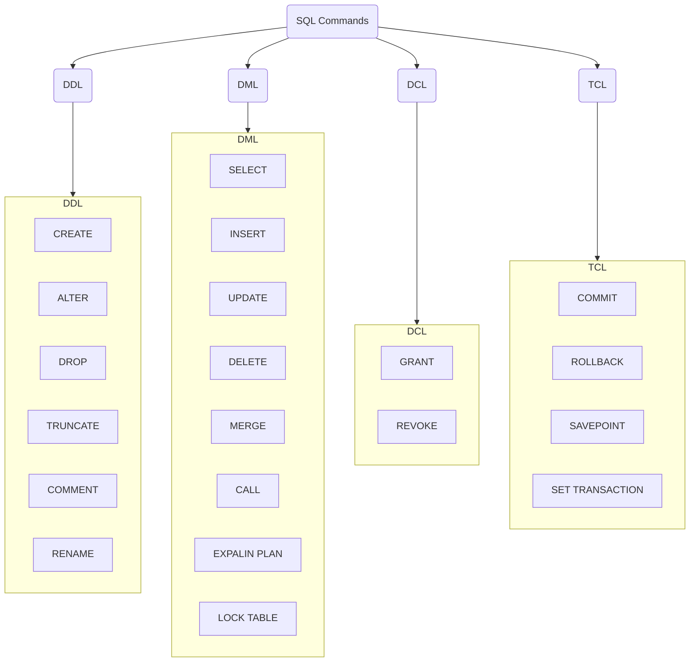

# [SQL Commands](https://www.w3schools.in/mysql/ddl-dml-dcl/)

## Overview

DDL is short name of **Data Definition Language,** which deals with database schemas and descriptions, of how the data should reside in the database.

- CREATE - to create a database and its objects like (table, index, views, store procedure, function, and triggers)
- ALTER - alters the structure of the existing database
- DROP - delete objects from the database
- TRUNCATE - remove all records from a table, including all spaces allocated for the records are removed
- COMMENT - add comments to the data dictionary
- RENAME - rename an object

## DML

DML is short name of **Data Manipulation Language** which deals with data manipulation and includes most common SQL statements such SELECT, INSERT, UPDATE, DELETE, etc., and it is used to store, modify, retrieve, delete and update data in a database.

- SELECT - retrieve data from a database
- INSERT - insert data into a table
- UPDATE - updates existing data within a table
- DELETE - Delete all records from a database table
- MERGE - UPSERT operation (insert or update)
- CALL - call a PL/SQL or Java subprogram
- EXPLAIN PLAN - interpretation of the data access path
- LOCK TABLE - concurrency Control

## DCL

DCL is short name of **Data Control Language** which includes commands such as GRANT and mostly concerned with rights, permissions and other controls of the database system.

- GRANT - allow users access privileges to the database
- REVOKE - withdraw users access privileges given by using the GRANT command

## TCL

TCL is short name of Transaction Control Language which deals with a transaction within a database.

- COMMIT - commits a Transaction
- ROLLBACK - rollback a transaction in case of any error occurs
- SAVEPOINT - to rollback the transaction making points within groups
- SET TRANSACTION - specify characteristics of the transaction
