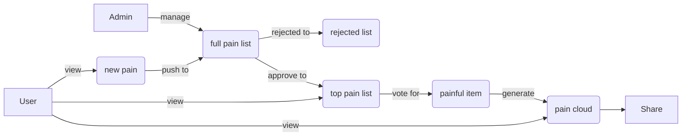

## Pain Button

一个供大家匿名吐槽的乌托邦，收集员工在组织或公司遇到痛点的微信小程序，相互分享痛点和吐槽。期待还是要有，万一哪天痛点被解决了呢

## 目录

## 1. 概述

### 1.1 背景

注册参加了浦东工会和CSTC工会组织的微信小程序大赛，小程序名称为Pain Button。

| Item                      | Date               |
| ------------------------- | ------------------ |
| Audit Day for Project     | 2021/8/4--2021/8/6 |
| Audit Annoucemant in CSTC | 2021/8/9           |
| Audit Start In Pudong     | 2021/8/19          |

### 1.2 目的和范围

本文旨在明确Pain Button 小程序具备的功能与性能，为本小程序的设计和编程提供基础，为测试和验收提供依据。

### 1.3 术语表

| 表单名称 | 说明 |
| -------- | ---- |
|          |      |
|          |      |

### 1.4 微信小程序定制与开发流程

制作微信小程序需要什么条件？

1、手机号、邮箱、营业执照或者认证过的微信公众号,

2、如果没有认证过的公众号就需要认证，费用微信收取300元。需要营业执照（个体户或者公司）邮箱、手机号、个人身份证、营业执照公章、对个人银行卡号或者企业对公账户、企业开户行、实名认证过的微信号扫码

具体流程：

1. 确定小程序内容和定位，例如所属行业、目标用户、所需功能（重点）、所需内容
2. 小程序界面的UI设计，包括整体的页面风格，每一个页面、按钮、icon、字体、色系等内容。初版完成需要和客户对接审核，是否需要更改设计细节，然后敲定设计方案开始开发
3. 小程序开发，程序制作，后台制作，设计稿交付前端切片，程序编辑制作
4. 基本功能和界面完成后，将添加客户相关的素材，资料的文本图片内容，进一步完成小程序
5. 基本完成后，需要进行小程序测试。找到需要优化的项和需要修改的bug
6. 然后开始申请注册小程序，参考《微信小程序接入指南》
7. 完善信息，填写微信小程序名字，介绍，上传小程序头像，设置关键词
8. 上传小程序版本进行审核，审核通过的话会收到信息
9. 生成线上版本，发布版本，设置允许被搜索
10. 附近小程序添加，按照营业执照，添加小程序的地点位置
11. 添加行业的关键词，方便搜索。目前是自然流量的主要来源之一
12. 交由客户使用，接收客户反馈的问题，进行解决，后期维护

## 2. 角色描述

| 用户角色       | 角色描述                 |
| -------------- | ------------------------ |
| 痛点提交用户   | 可新建痛点条目           |
| 普通浏览用户   | 可查看痛点及点赞相应痛点 |
| 小程序管理用户 | 可登陆界面管理及导出数据 |

## 3. 产品概要

### 3.1 产品介绍

### 3.2 主要业务流程

### 3.3 功能概要

| 页面 | 子模块 | 主要功能点 | 优先级 |
| ---- | ------ | ---------- | ------ |
| 新增 |        |            |        |
|      |        |            |        |
|      |        |            |        |

## 4. 产品特性

## 5. 权限规则

## 6. 其他产品需求

## 7. 风险分析

## 8. 参考资料

- [团队协作](https://shimo.im/space/1d3aV5PYWKFezJqg)
- [UI 设计](https://www.figma.com/file/PagtiBWuZbHKJKrUeixjCR/Untitled?node-id=0%3A1)
- [小程序画布功能+Java用KUMO生成词云图片](https://blog.csdn.net/qq_35537722/article/details/86229175)

---

End