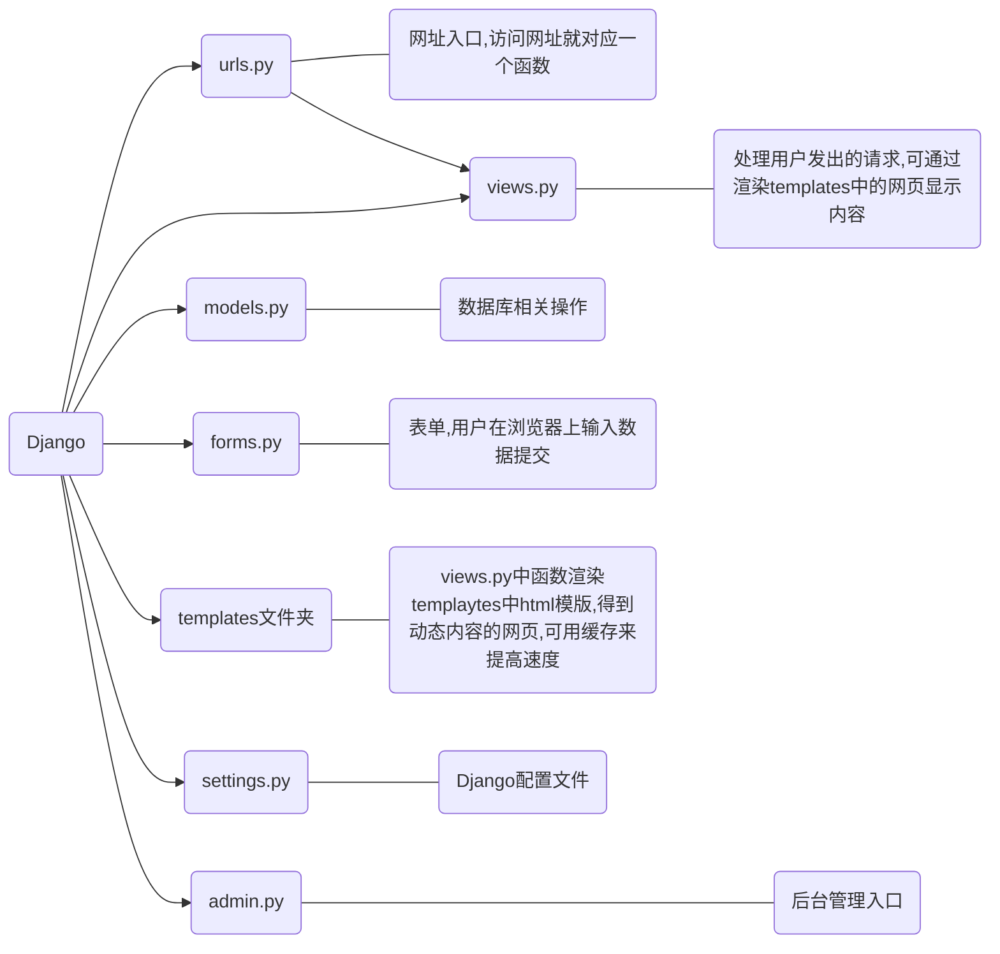
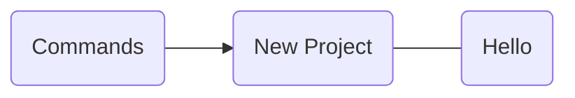

# Django 介绍

## 1. 简介

Django 中提供了开发网站经常用到的模块，常见的代码都为你写好了，通过减少重复的代码，Django 使你能够专注于 web 应用上有趣的关键性的东西。为了达到这个目标，Django 提供了通用Web开发模式的高度抽象，提供了频繁进行的编程作业的快速解决方法，以及为“如何解决问题”提供了清晰明了的约定。Django的理念是DRY(Don't Repeat Yourself)来鼓励快速开发！

- 整体设计

   Django是一个已经给你准备了**大量方便工具**的框架

  - **表单怎么解决？** Django Form 很好用呀。
  - **跨站攻击？** Django 帮你做了 csrftoken
  - **登陆认证鉴权怎么搞定？** Django 自带了 backend 和 auth 模块。**ORM 怎么挑选？**Django ORM 很好用。
  - **DBMigration 怎么做？** Django Migration 了解一些？
  - **缓存怎么做？** Django Cache 了解一下？

- 文档

  - Django 是看了文档就能撸一个不错的项目出来
  - 开发者较多，文档很丰富

- 社区

  - 社区活跃，拓展多

## 2. 快速上手

### 2.1 一览Django 全貌



### 2.2 环境搭建

- 版本选择
  - Django 2.0.x 支持 Python 3.4, 3.5 和 3.6 （最后一个支持 Python 3.4 的版本）
  - Django 2.1.x 支持 Python 3.5, 3.6 和 3.7
  - **Django 2.2.x 支持 Python 3.5, 3.6 和 3.7 （LTS 长期支持版本）**

> 一般来说，选择长期支持版本比较好。Django3.0测试版本也发布了，但主要是支持ASGI，不影响学习，所以不要纠结，选择一个版本好好学下去就行了。

- 安装Django

  ```shell
  brew install python
  brew install python-pip
  pip install Django
  ```

- 使用Django

  > 推荐使用Pycharm 使用

### 2.3 基本命令




### 2.3 创建第一个Django 工程


## References

- [Django官方文档](https://www.djangoproject.com/)
- [Django Rest Framework 官方文档](https://www.django-rest-framework.org/)
- [Django 2.2 基础教程](https://code.ziqiangxuetang.com/django/django-tutorial.html)
- [Python 有哪些好用的框架](https://www.zhihu.com/question/20706333)
- [2018 年不容错过的 Django 全栈项目 YaDjangoBlog](https://zhuanlan.zhihu.com/p/33903527)