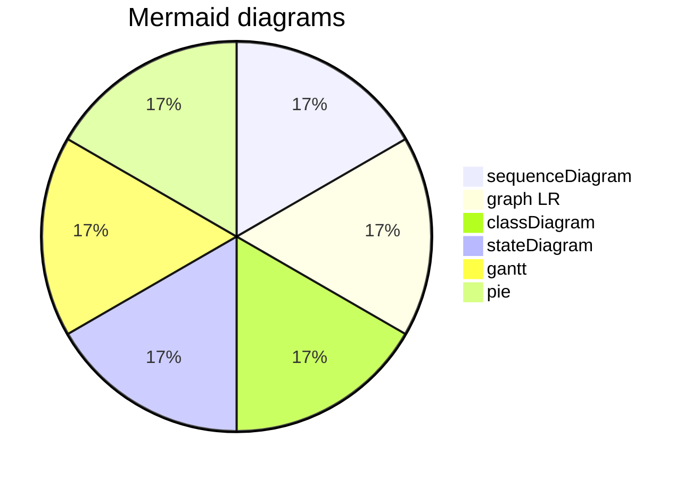
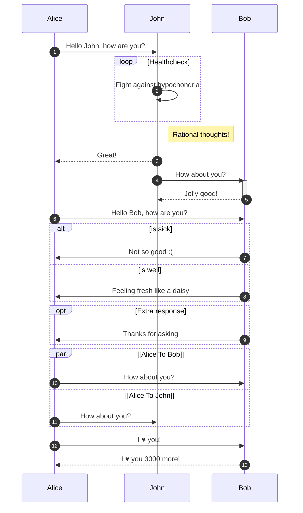
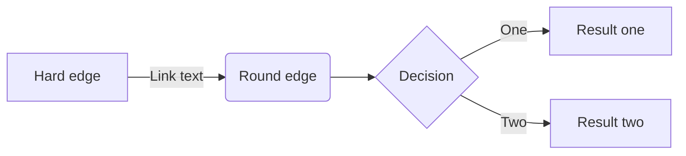

# Mermaid

## [About Mermaid](https://mermaid-js.github.io/mermaid/#/README)

**Mermaid lets you create diagrams and visualizations using text and code.**

It is a Javascript based diagramming and charting tool that renders Markdown-inspired text definitions to create and modify diagrams dynamically.

[Typora-Draw Diagrams With Markdown](https://support.typora.io/Draw-Diagrams-With-Markdown/)

## Diagrams

- Sequence Diagrams: `sequenceDiagram`
- Flowcharts: `graph LR`
- Class Diagrams: `classDiagram`
- State Diagrams: `stateDiagram`
- Gantt Charts: `gantt`
- Pie Charts: `pie`



## Sequence Diagrams

Label: `sequenceDiagram`

A sequence diagram is **a type of interaction diagram** because it describes how—and in what order—a group of objects works together. These diagrams are used by software developers and business professionals to understand requirements for a new system or to document an existing process.

```
sequenceDiagram
participant Alice
participant John
participant Bob
autonumber
Alice->>John: Hello John, how are you?

%% loop example
  loop Healthcheck
  John->>John: Fight against hypochondria
  end

%% Note Example
	Note right of John: Rational thoughts!

John-->>Alice: Great!
John->>Bob: How about you?
activate Bob
Bob-->>John: Jolly good!
deactivate Bob

%% Alt Example
  Alice->>Bob: Hello Bob, how are you?
  alt is sick
  Bob->>Alice: Not so good :(
  else is well
  Bob->>Alice: Feeling fresh like a daisy
  end
  opt Extra response
  Bob->>Alice: Thanks for asking
  end
  
%% Paraller example
  par [Alice To Bob]
  Alice->>Bob: How about you?
  and [Alice To John]
  Alice->>John: How about you?
  end

%% Entity codes to escape characters
  Alice->>Bob: I #9829; you!
  Bob-->>Alice: I #9829; you 3000 more!
```



### Basic symbols and components

To understand what a sequence diagram is, you should be familiar with its symbols and components. Sequence diagrams are made up of the following icons and elements:

| Symbol                                                       | Name               | Description                                                  |
| ------------------------------------------------------------ | ------------------ | ------------------------------------------------------------ |
|  | Object symbol      | Represents a class or object in UML. The object symbol demonstrates how an object will behave in the context of the system. Class attributes should not be listed in this shape. |
|  | Activation box     | Represents the time needed for an object to complete a task. The longer the task will take, the longer the activation box becomes. |
|  | Actor symbol       | Shows entities that interact with or are external to the system. |
|  | Package symbol     | Used in UML 2.0 notation to contain interactive elements of the diagram. Also known as a frame, this rectangular shape has a small inner rectangle for labeling the diagram. |
|  | Lifeline symbol    | Represents the passage of time as it extends downward. This dashed vertical line shows the sequential events that occur to an object during the charted process. Lifelines may begin with a labeled rectangle shape or an actor symbol. |
|  | Option loop symbol | Used to model if/then scenarios, i.e., a circumstance that will only occur under certain conditions. |
|  | Alternative symbol | Symbolizes a choice (that is usually mutually exclusive) between two or more message sequences. To represent alternatives, use the labeled rectangle shape with a dashed line inside. |

### Common message symbols

Use the following arrows and message symbols to show how information is transmitted between objects. These symbols may reflect the start and execution of an operation or the sending and reception of a signal.

| Symbol                                                       | Name                               | Description                                                  |
| ------------------------------------------------------------ | ---------------------------------- | ------------------------------------------------------------ |
|  | Synchronous message symbol         | Represented by a solid line with a solid arrowhead. This symbol is used when a sender must wait for a response to a message before it continues. The diagram should show both the call and the reply. |
|  | Asynchronous message symbol        | Represented by a solid line with a lined arrowhead. Asynchronous messages don't require a response before the sender continues. Only the call should be included in the diagram. |
|  | Asynchronous return message symbol | Represented by a dashed line with a lined arrowhead.         |
|  | Asynchronous create message symbol | Represented by a dashed line with a lined arrowhead. This message creates a new object. |
|  | Reply message symbol               | Represented by a dashed line with a lined arrowhead, these messages are replies to calls. |
|  | Delete message symbol              | Represented by a solid line with a solid arrowhead, followed by an X. This message destroys an object. |

There are six types of arrows currently supported:

| Type | Description                                      |
| ---- | ------------------------------------------------ |
| ->   | Solid line without arrow                         |
| -->  | Dotted line without arrow                        |
| ->>  | Solid line with arrowhead                        |
| -->> | Dotted line with arrowhead                       |
| -x   | Solid line with a cross at the end               |
| --x  | Dotted line with a cross at the end.             |
| -)   | Solid line with an open arrow at the end (async) |
| --)  | Dotted line with a open arrow at the end (async) |

## Flowcharts

Label: `graph LR`

Possible FlowChart orientations are:

- TB - top to bottom
- TD - top-down/ same as top to bottom
- BT - bottom to top
- RL - right to left
- LR - left to right

```
graph LR
    A[Hard edge] -->|Link text| B(Round edge)
    B --> C{Decision}
    C -->|One| D[Result one]
    C -->|Two| E[Result two]
```



Learn more at: [Mermaid - Flowchart](https://mermaid-js.github.io/mermaid/#/flowchart)

### Most used flow chart symbols

| Meaning                      | Symbols                                                      |
| ---------------------------- | ------------------------------------------------------------ |
| Terminal/Terminator          |  |
| Process                      |  |
| Decision                     |  |
| Document                     |  |
| Data, or Input/Output        |  |
| Stored Data                  |  |
| Flow Arrow                   |  |
| Comment or Annotation        |  |
| Predefined process           |  |
| On-page connector/reference  |  |
| Off-page connector/reference |  |

### Common flowchart symbols

| Flowchart Symbol                                             | Name                           | Description                                                  |
| :----------------------------------------------------------- | :----------------------------- | :----------------------------------------------------------- |
|  | Process symbol                 | Also known as an “Action Symbol,” this shape represents a process, action, or function. It’s the most widely-used symbol in flowcharting. |
|  | Start/End symbol               | Also known as the “Terminator Symbol,” this symbol represents the start points, end points, and potential outcomes of a path. Often contains “Start” or “End” within the shape. |
|  | Document symbol                | Represents the input or output of a document, specifically. Examples of and input are receiving a report, email, or order. Examples of an output using a document symbol include generating a presentation, memo, or letter. |
|  | Decision symbol                | Indicates a question to be answered — usually yes/no or true/false. The flowchart path may then split off into different branches depending on the answer or consequences thereafter. |
|  | Connector symbol               | Usually used within more complex charts, this symbol connects separate elements across one page. |
|  | Off-Page Connector/Link symbol | Frequently used within complex charts, this symbol connects separate elements across multiple pages with the page number usually placed on or within the shape for easy reference. |
|  | Input/Output symbol            | Also referred to as the “Data Symbol,” this shape represents data that is available for input or output as well as representing resources used or generated. While the paper tape symbol also represents input/output, it is outdated and no longer in common use for flowchart diagramming. |
|  | Comment/Note symbol            | Placed along with context, this symbol adds needed explanation or comments within the specified range. It may be connected by a dashed line to the relevant section of the flowchart as well. |

### Additional flowchart symbols

Many of these additional flowchart symbols are best utilized when mapping out a process flow diagram for apps, user flow, data processing, etc.

| Flowchart Symbol                                             | Name                      | Description                                                  |
| :----------------------------------------------------------- | :------------------------ | :----------------------------------------------------------- |
|  | Database symbol           | Represents data housed on a storage service that will likely allow for searching and filtering by users. |
|  | Paper tape symbol         | An outdated symbol rarely ever used in modern practices or process flows, but this shape could be used if you’re mapping out processes or input methods on much older computers and CNC machines. |
|  | Summing junction symbol   | Sums the input of several converging paths.                  |
|  | Predefined process symbol | Indicates a complicated process or operation that is well-known or defined elsewhere. |
|  | Internal storage symbol   | Commonly used to map out software designs, this shape indicates data that is stored within internal memory. |
|  | Manual input symbol       | Represents the manual input of data into a field or step in a process, usually through a keyboard or device. Example scenario includes the step in a login process where a user is prompted to enter data manually. |
|  | Manual operation symbol   | Indicates a step that must be done manually, not automatically. |
|  | Merge symbol              | Combines multiple paths to become one.                       |
|  | Multiple documents symbol | Represents multiple documents or reports.                    |
|  | Preparation symbol        | Differentiates between steps that prepare for work and steps that actually do work. It helps introduce the setup to another step within the same process. |
|  | Stored data symbol        | Also known as “Data Storage” symbol, this shape represents where data gets stored within a process. |
|  | Delay symbol              | Represents a segment of delay in a process. It can be helpful to indicate the exact length of delay within the shape. |
|  | Or symbol                 | Just as described, this shape indicates that the process flow continues two paths or more. |
|  | Display symbol            | This shape is useful to indicate where information will get displayed within a process flow. |
|  | Hard disk symbol          | Indicates where data is stored within a hard drive, also known as direct access storage. |


## Class Diagrams

Label: `classDiagram`

## Gantt Charts

Label: `gantt`

## Pie Charts

Label: `pie`

## References

- [UML Sequence Diagram Tutorial](https://www.lucidchart.com/pages/uml-sequence-diagram)
- [What is Flowchart](https://www.lucidchart.com/pages/what-is-a-flowchart-tutorial/#section_3)
- [Flowchart Symbols and Notation](https://www.lucidchart.com/pages/flowchart-symbols-meaning-explained/#section_2)
- [Mermaid Diagram Syntax](https://mermaid-js.github.io/mermaid/#/)